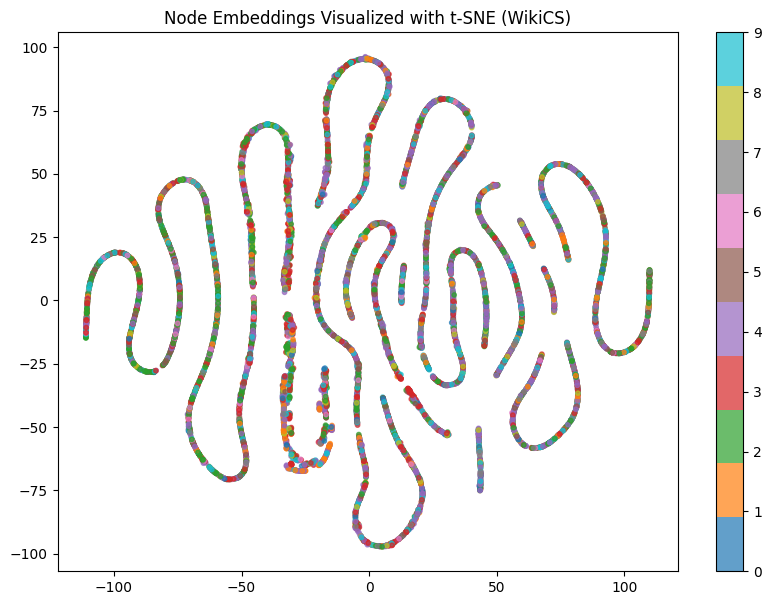

# Link Prediction with GCN on WikiCS

This project demonstrates how to perform **link prediction** on the [WikiCS](https://arxiv.org/abs/2007.02901) dataset using **Graph Convolutional Networks (GCN)** and **Graph Autoencoders (GAE)** from **PyTorch Geometric**.

> Based on Chapter 10 from the book: *Hands-On Graph Neural Networks Using Python*

## Files

- `link_prediction_wikics.ipynb`: Jupyter Notebook with full implementation.

## Model Architecture

- **Encoder**: 2-layer GCN
- **Autoencoder**: GAE (Graph Autoencoder)
- **Loss**: Reconstruction loss between positive and negative sampled edges

## Evaluation Metrics

- **AUC (Area Under Curve)**
- **AP (Average Precision)**

## How to Run

1. Clone the repo or download the notebook.
2. Open the notebook and run all cells.

## Results

The notebook will print loss values and final performance metrics like:

```
Epoch 200, Loss: 1.1163
AUC: 0.8391, AP: 0.8578
```
Visual representation



## Reference

- [Hands-On Graph Neural Networks Using Python](https://github.com/PacktPublishing/Hands-On-Graph-Neural-Networks-Using-Python)
- PyTorch Geometric documentation: https://pytorch-geometric.readthedocs.io